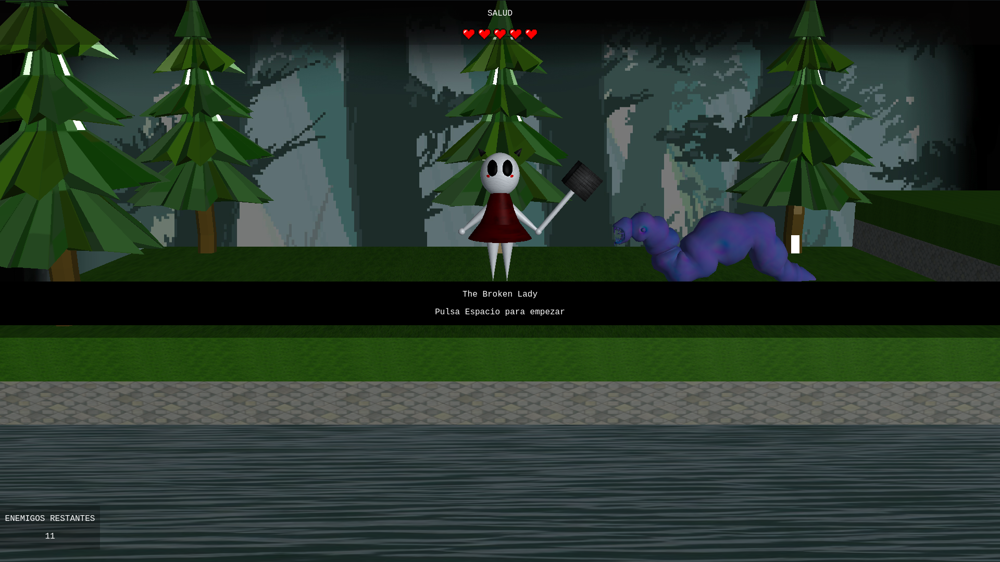
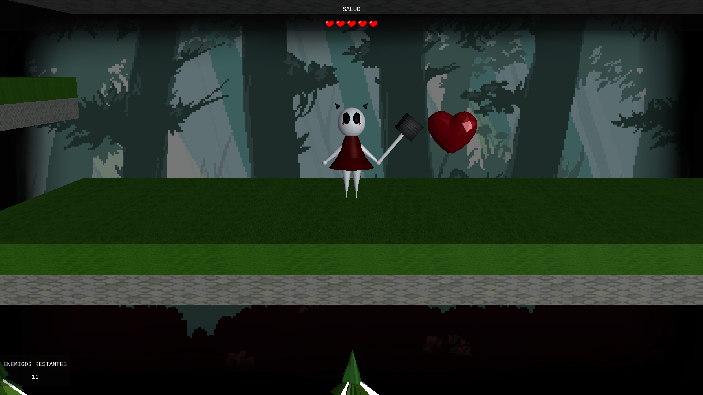

# The Broken Lady

Pequeño videojuego inspirado en [Hollow Knight](https://store.steampowered.com/app/367520/Hollow_Knight/) utilizando algunas librerías de JavaScript como [Three.js](https://threejs.org/).
Proyecto realizado para la asignatura de Sistemas Gráficos en la Universidad de Granada.

Puede probar el juego en el siguiente enlace: [The Broken Lady](https://raulsoria98.github.io/The-Broken-Lady/)

--------------------

## Manual de Usuario

### Controles

- **A:** Desplazamiento a la izquierda
- **D:** Desplazamiento a la derecha
- **Q:** Atacas con la maza
- **SPACE:** Saltar / Iniciar juego
- **S:** Lady mira hacia ti
- **N:** Nueva partida (cuando mueres o ganas)
- **P:** Pausar/reanudar la partida

### Cómo se desarrolla el juego
Apareces en una plataforma junto con tu maza, a medida que vayas avanzando te
encontrarás con enemigos que te harán daño si te tocan. Si caes al agua, mueres
instantáneamente.

Ataca a los enemigos con tu maza y elimínalos a todos para poder ganar la partida.

Cuando un enemigo te ataque pererás una vida pero tendrás 2 segundos de invulnerabilidad en los que no recibirás daño.

Tu nivel de vida aparece anclado arriba de la pantalla, cuando te quedes sin vidas, morirás y tendrás que empezar desde el principio.

Si encuentras un corazón por el mapa, no dudes en acercarte, recuperarás 1 punto de vida
al recogerlo.

